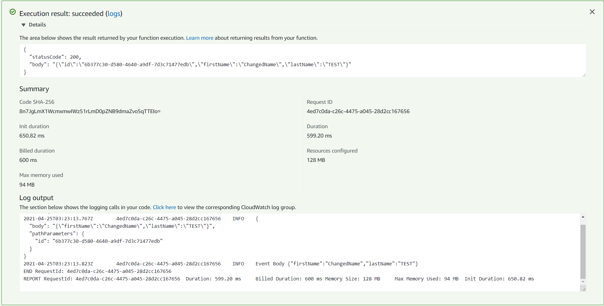
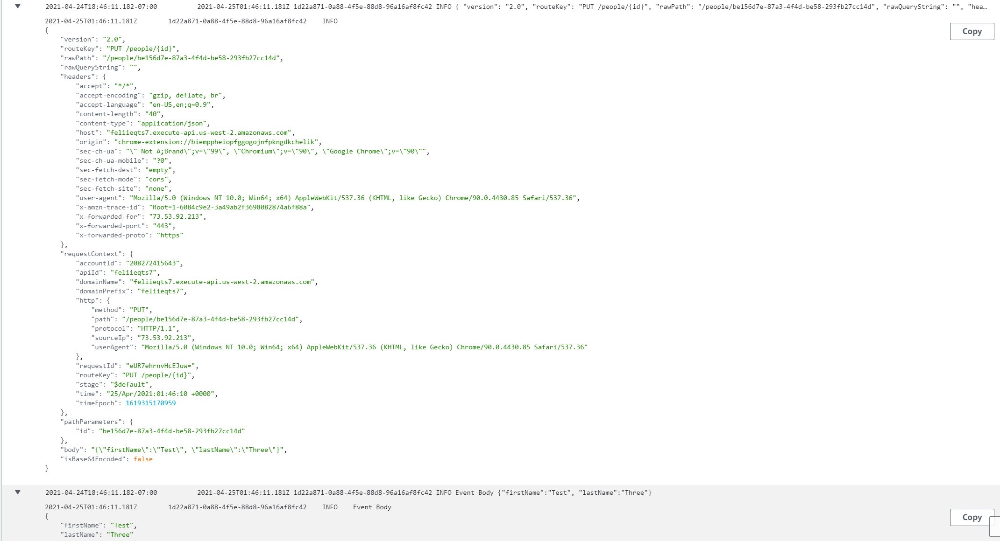

# Lambda Update

Lambda function uploaded on AWS, that gets person model from DynamoDB on AWS.

API base URL: https://feliieqts7.execute-api.us-west-2.amazonaws.com/people/

##Endpoints

- PUT /people/{id} - updates existing person with new parameters passed through body.

## Tests

